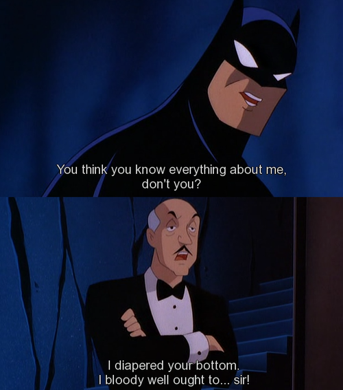

# Alfred User Guide
By: `Oscar Lai` Latest Update: `28-Feb-2021`




- [Alfred Guide](#alfred-user-guide)
   * [1. Introduction](#1-introduction)
   * [2. Quick Start](#2-quick-start)
      + [2.1. Quick start using latest jar file](#21-quick-start-by-downloading-the-latest-jar-file)
      + [2.2. Quick start using IntelliJ](#22-quick-start-on-intellij-version-202032-latest-and-beyond)
   * [3. Features](#3-features)
      + [3.1. Todo](#31-add-a-todo-task-todo)
      + [3.2. Deadline](#32-add-a-deadline-task-deadline)
      + [3.3. Event](#33-add-an-event-task-event)
      + [3.4. List](#34-list-all-tasks-list)
      + [3.5. Done](#35-mark-a-task-as-done-done)
      + [3.6. Delete](#36-delete-a-task-delete)
      + [3.7. Find](#37-search-task-by-a-keyword-find)
      + [3.8. Help](#38-find-list-of-commands-help)
      + [3.9. Bye](#39-exit-program-bye)
      + [3.10 Task Storage](#310-task-storage)
         - [3.10.1. Loading Data](#3101-loading-data)
         - [3.10.2. Saving Data](#3102-saving-data)
   * [4. FAQ](#4-faq)
   * [5. Command Summary](#5-command-summary)

## 1. Introduction 
Who is Gotham's true saviour? Is it the Dark Knight? Is it Robin or is it Batgirl? The true
answer is none other than Alfred Pennyworth. Alfred will help you keep track of your busy schedule noting your
todo, events and deadlines, optimized for use via a **Command Line Interface** CLI. He will mark it as done and remind you the tasks you have left. He is the silent guardian, the
watchful protector, a dark knight.

## 2. Quick Start 
Prerequisites: JDK11, the latest version of IntelliJ

###2.1 Quick Start by downloading the latest jar file
1. Ensure you have Java `11` installed in your computer.
2. Download the latest `Duke.jar` from [here](https://github.com/oscarlai1998/ip/releases).
3. Copy the file to a new folder you want to run `Duke` in.
4. For Windows User, open **Command Prompt**.

   For Mac Users, open **Terminal**.

   Navigate to the directory containing `Duke.jar` file.

   i.e. `cd <FILEPATH>`
5. Run Duke.jar file by using the command `java -jar Duke.jar`.

### 2.2  Quick start on IntelliJ version 2020.3.2 (latest) and beyond
1. Clone the latest version of the project to your local computer from [here](https://github.com/oscarlai1998/ip).
2. Open IntelliJ (if you are not in the welcome screen, click `File` > `Close Project` to close the existing project first)
3. Import the project by:
   
   i. Click `Open`

   ii. Find and select the project directory, and click `OK`

   iii. Accept default options
4. Configure the project to use JDK11, as explained in [here](http://www.jetbrains.com/help/idea/sdk.html#set-up-jdk).
5. Locate  `src/main/java/Duke.java` file, right-click it, and `Run Duke.main()`. 

**If the setup is correct, the expected output should be:**
   
```
============================================================
Welcome to Duke v1.1 ----------- Latest Update: 28/2/21
Developed by: Oscar Lai
============================================================
Good Day, I'm Alfred.
⊂_ ヽ
　 ＼ ＼ ^^^^^^
　　 ＼ ( ͡° ͜ʖ ͡°) ...what can I do for you?
　　　 >　   ⌒ ヽ
　　　/ 　 へ   ＼
　　 / # /　 ＼ ＼...check out my six pack tho.
　　(　  (ヽ　　ヽ _ つ
   |  　| \
　  | 丿 ＼ ⌒)...Enter HELP for command list!
　  | |　　) /
   ノ )　　Lﾉ
  (_／
============================================================
```

## 3. Features
>**Notes about the command format:**
> - Command inputs are not `case sensitive`
> 
>  e.g. `todo sleep` is the same as `TODO sleep`
> - Unknown parameters will result in an error
### 3.1. Add a Todo task: `todo`
This command adds a todo task to the list.

Format: `todo <task description>`

Example: `todo save gotham`

Expected Output:

```
I have added [T][ ] "save gotham" to the List!
You have 1 task in total!
============================================================
```

### 3.2. Add a Deadline task: `deadline`
This command adds a deadline task to the list.

Format: `deadline <task description> /by <DD-MM-YYYY>`

Example: `deadline solve all crimes /by 25 April 2021`

Expected Output:

```
I have added [D][ ] "solve all crimes (By: 25 April 2021)" to the List!
You have 2 tasks in total!
============================================================
```

### 3.3. Add an Event task: `event`
This command adds an event task to the list.

Format: `event <task description> /by <DD-MM-YYYY>`

Example: `event meeting with Commissioner Gordon /at 8 June 2021`

Expected Output:

```
I have added [E][ ] "meeting with Commissioner Gordon (At: 8 June 2021)" to the List!
You have 3 tasks in total!
============================================================
```

### 3.4. List all tasks: `list`
This command lists all tasks recorded in the task list.

Format: `list`

Expected Output:

```
 LIST
1. [T] [ ] save gotham
2. [D] [ ] solve all crimes (By: 25 April 2021)
3. [E] [ ] meeting with Commissioner Gordon (At: 8 June 2021)
============================================================
```

### 3.5. Mark a task as done: `done`
This command marks a task as completed.

Format: `done <task number>`

Example: `done 2`

Expected Output:

```
Good Job, I will mark this as done!
[D] [✓] solve all crimes (By: 25 April 2021)
============================================================
```

### 3.6. Delete a task: `delete`
This command deletes a task from the list.

Format: `delete <task number>`

Example: `delete 2`

Expected Output:

```
Noted! I will delete this at once!
[D] [✓] solve all crimes (By: 25 April 2021)
You have 2 tasks in total!
============================================================
```

### 3.7. Search task by a keyword: `find`
This command searches the task list and shows all the tasks that contains
the keyword in the task description

Format: `find <keyword>`

Example: `find Gordon`

Expected Output:

```
I have found the follow items: 
1. [E][ ] "meeting with Commissioner Gordon (At: 8 June 2021)"
============================================================
```
### 3.8. Find list of commands: `help`
This command shows the list of commands in the program.

Format: `help`

Expected Output:

```
 HELP COMMANDS
todo: adds a todo task to the list
 Example: todo sleep

deadline: adds a deadline task to the list
 Example: deadline homework /by tomorrow

event: adds an event task to the list
 Example: event birthday party /at tuesday

List: view list
 Example: list

Help: view help commands
 Example: Help

Done: mark a task as done
 Example: Done 2

Delete: deletes a task from list
 Example: delete 2

Find: find task that contains substring of input
 Example: find birthday

Duke.txt Format: 
[ ] todo save gotham
[ ] event meeting with Commissioner Gordon at 8 June 2021
[ ] deadline pay ransom money by  31 May 2021 3pm

Bye:  terminate program
 Example: bye

============================================================
```

### 3.9. Exit program: `bye`
This command exits the program.

Format: `bye`

Expected Output:

```
Pleasure serving you...
 __      __
( _\    /_ )
 \ _\  /_ /
  \ _\/_ /_ _
  |_____/_/ /|
  (  (_)__)J-)
  (  /`.,   /
   \/  ;   /
    | === |See you again!
```

### 3.10. Task Storage

#### 3.10.1. Loading Data

Alfred will automatically import any existing data from **Duke.txt** file. 

`Duke.txt Format`

```
[ ] todo save gotham
[ ] event meeting with Commissioner Gordon at 8 June 2021
[ ] deadline pay ransom money by  31 May 2021 3pm
```

Expected output after loading program:
```
Duke.txt successfully synced!
============================================================
```
#### 3.10.2. Saving Data

Alfred will automatically **save Duke.txt** in the hard disk after user exits the program via `bye`

Expected output after exiting program:
```
Duke.txt file Updated!
============================================================
Developed by: Oscar Lai
Version 1.1
============================================================
```

**Note: If you exit the program without `bye`, no new data is saved.**

## 4. FAQ
**Q1: What if I do not have a Duke.txt file?**
> Alfred will automatically create a Duke.txt if you do not have one.

**Q2: Where is my Duke.txt file?**
> For Window Users: Type **Duke.txt** in the search panel
> 
> For Mac Users: Use **Spotlight** or **Finder**

## 5. Command Summary
**Command** | **Format** | **Example**
------------ | -------------------- | ------------
todo | `todo <task description>` | `todo save gotham`
deadline | `deadline <task description> /by <dd-mm-yyyy>` | `deadline pay ransom money /by 21-March-2021`
event | `event <task description> /at <dd-mm-yyyy>` | `event gotham ball /at 31-May-2021`
list | `list` | `list`
done | `done <task number>` | `done 1`
delete | `delete <task number>` | `delete 2`
find | `find <keyword>` | `find gotham`
help | `help` | `help`
bye | `bye` | `bye`
