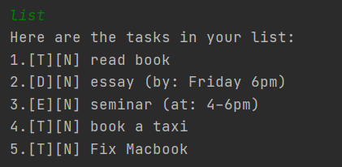
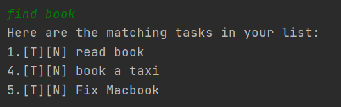

# User Guide
Duke is a **desktop app for managing a schedule planner, optimized for use
via a Command Line Interface** (CLI). 
If you can type fast, Duke can get your schedule planning
done faster than traditional GUI apps.

* Quick Start
* User Notes 
* Features
  * Adding a todo: `todo`
  * Adding an event: `event`
  * Adding a deadline: `deadline`
  * Listing all tasks: `list`  
  * Marking a task as done: `done`
  * Deleting a task: `delete`
  * Search for a task: `find`
  * Exiting the program: `bye`
  * Saving the data
  * Editing the data file
* FAQ
* Command Summary
* Attribution

----

## Quick Start

1. Ensure you have Java `11` or above installed in your Computer.

2. Download the latest `Duke_ip.jar` 
   from [here](https://github.com/Leeyp/ip/releases).

3. Copy the file to the folder you want to use 
   as the home folder for your Duke.

4. Open your Command Line Terminal in that folder where `Duke_ip.jar` is 
   located. Run Duke with `java -jar Duke_ip.jar`.
   
5. Type the command in the command box and press Enter to execute
   it. e.g. typing `list` and pressing Enter will show a list of 
   all current tasks.
   Some example commands you can try:
   * `list`: Lists all tasks
    * `todo homework`: Adds a Todo task named `homework` to the Task List
    * `done 1`: Marks the 1st task shown in the current list (currently: `todo homework`) as done.
    * `delete 1`: Deletes the 1st task shown in the current list (currently: `todo homework`).
    * `bye`: Exits the app.
    
6. Refer to the **Features** below for details of each command.

____

## User Notes
_Notes about the command format:_

* _Words in `UPPER_CASE` are the parameters to be supplied by the user.
e.g. in `done TASK_INDEX`, `TASK_INDEX` is a parameter which can be used as `done 1`._
  

* _If a parameter is expected only once in the command but you specified it multiple times, only the first occurrence of the parameter will be recognised.
e.g. if you specify `/at 2pm /at 5pm`, the command will be recognised as `/at "2pm /at 5pm"`, giving the result: `(at: 2pm /at 5pm)`._

* _Extraneous parameters for commands that do not take in parameters (such as `list` and `bye`) will be ignored.
e.g. if the command specifies `bye 123`, it will be interpreted as `bye`._

_Notes about Tasks in Duke:_

* There are three types of Tasks used in Duke: `Todo`, `Event`, and `Deadline`.
    * These tasks differ in how they record `TIME` data parameter supplied by the user.
    * `TIME` data parameter is a string, that will not be validated by Duke. Users can supply any string input to help them 
    remember their event or deadline times.
* A `Todo` is a task which does not record `TIME` data.
* An `Event` is a task that is meant to be performed during a certain `TIME`, as supplied by the user.
* A `Deadline` is a task that is meant to be completed before a certain `TIME`, as supplied by the user.
* A Task stored in Duke follows the format:
    * `[type (T/E/D)][isDone (Y/N)] taskDescription (time, if any)`
* Examples:
    * `Todo: ` `[T][N] myTodo`
    * `Event:` `[E][N] myEvent (at: event time)`
    * `Deadline:` `[D][Y] myDeadline (by: deadline time)`
    
____

## Features

### Adding a todo: `todo`
Adds a task to be done at an unspecified time to Duke's Task List.

Format: `todo TASK`

Examples:
* `todo read book` creates `[T][N] read book`
* `todo my homework` creates `[T][N] my homework`

### Adding an event: `event`
Adds an event to be done during a certain time to Duke's Task List.

Format: `event TASK /at TIME`
* The `TIME` specified can be any text string, Duke will not validate the data.
* The `/at` tag must be provided for Duke to recognise the `TIME` parameter. Otherwise, 
the input will be flagged as invalid.

Examples:
* `event seminar /at 4-6pm` creates `[E][N] seminar (at: 4-6pm)`
* `event zoom lecture /at 9-10am` creates `[E][N] zoom lecture (at: 9-10am)`

### Adding a deadline: `deadline`
Adds a deadline to be done by a certain time to Duke's Task List.

Format: `deadline TASK /by TIME`
* The `TIME` specified can be any text string, Duke will not validate the data.
* The `/by` tag must be provided for Duke to recognise the `TIME` parameter. Otherwise,
  the input will be flagged as invalid.

Examples:
* `deadline essay /by Friday 6pm` creates `[D][N] essay (by: Friday 6pm)`
* `deadline Lab Assignment /by 5 Mar 9am` creates `[D][N] Lab Assignment (by: 5 Mar 9am)`

### Listing all tasks: `list`
Shows a list of all tasks in Duke's Task List.

Format: `list`

### Marking a task as done: `done`
Marks a task as done in Duke's Task List.

Changes the "N" stored in a Task ("N" for "No") into a "Y" ("Y" for "Yes").

Format: `done TASK_INDEX`
* Marks a task as done at the specified `TASK_INDEX`.
* The task index refers to the index number shown in the displayed task list.
* The index **must be a valid task number present in `list`**.

Examples:
* `done 1` marks the first task as shown in `list` as done.
* If `[T][N] read book` was the first task that was marked as done, 
it will now become `[T][Y] read book`.
  

### Deleting a task: `delete`
Deletes a specified task in Duke's Task List.

Format: `delete TASK_INDEX`
* Deletes the task at the specified `TASK_INDEX`.
* The task index refers to the index number shown in the displayed task list.
* The index **must be a valid task number present in `list`**.

Examples:
* `delete 1` deletes the first task as shown in `list`.
* If `[T][N] read book` was the task that was deleted,
  it will no longer exist. The subsequent tasks will be moved
  forward in the list.
  

### Search for a task: `find`
Lists all tasks that contains a certain keyword in Duke's Task List.

Format: `find KEYWORD`
* The `KEYWORD` can be any user-supplied string.
* Duke will show a list of all tasks that contain `KEYWORD` in 
its task description.
  * In other words, the results of `find` are a subset of the results of `list`.
  

Examples:
* `find work` returns the tasks `homework` and `do housework`.
* `find book` returns the tasks `read book`, `book a taxi`, and `Fix Macbook`.

  

### Exiting the program: `bye`
Exits the program.

Format: `bye`

### Saving the data
Duke Task List data are saved in the hard disk automatically after any command that changes the data. 
There is no need to save manually.

### Editing the data file
Duke Task List data is saved as a text file `[JAR file location]/data.txt`.
Advanced users are welcome to update data directly by editing that data file.

**_Caution: If your changes to the data file makes its format invalid, 
Duke will not run._** Please manually fix the data in the file into the correct format, otherwise delete all the invalid data in order 
for Duke to resume operation.

____

## FAQ
**Q:** How do I transfer my data to another Computer?

**A:** Install the app in the other computer and overwrite the empty data file it creates with the file that contains the data of your previous Duke saved file.

____

# Command Summary

Action | Format, Examples
------------ | ---------------
**Add Todo**  | `todo TASK`  e.g. `todo read book`, `todo my homework`
**Add Event**  | `event TASK /at TIME`   e.g. `event seminar /at 4-6pm`, `event zoom lecture /at 9-10am`
**Add Deadline**  | `deadline TASK /by TIME`  e.g. `deadline essay /by Friday 6pm`, `deadline Lab Assignment /by 5 Mar 9am`
**List tasks**  | `list` 
**Mark Task as Done**  | `done TASK_INDEX`  e.g. `done 3`
**Delete**  | `delete TASK_INDEX`  e.g. `delete 1`
**Find**  | `find KEYWORD`  e.g. `find work`, `find essay`
**Exit**  | `bye`

# Attribution

The format of this User Guide was  adapted from [AddressBook Level 3(AB3) User Guide](https://se-education.org/addressbook-level3/UserGuide.html).