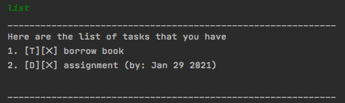
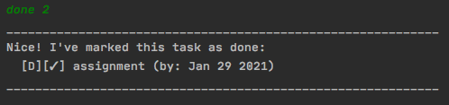
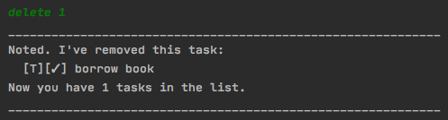
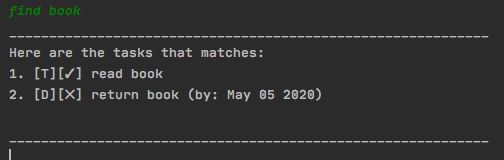
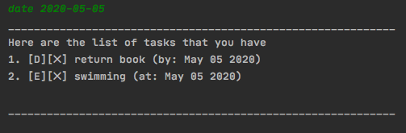

# Duke User Guide
Welcome to Duke. Duke is a command line chat bot that will help you in managing your tasks. This user guide will help you in getting started and familiarising yourself with using Duke.

# Getting Started
Here are two steps to follow to get started with using Duke:
1. Download JRE11
2. On your command line, run the following command: `java -jar Duke.jar` in the same folder as the jar file.

Duke should now be ready for use.
# Duke Functionalities

### Overview
Listed below are the 8 functions that Duke supports:

1. Adding task
2. Listing tasks
3. Marking tasks as done
4. Removing task
5. Finding tasks by name
6. Finding tasks by date
7. Saving your data
8. Exiting the program

Each of the following section will guide you on how to use the functions, along with the required command format to follow.

### 1. Adding task
There are three types of tasks that can be added in Duke: todo, deadline and event. Todo is the most basic form of task, which is just a task you have on hand. Deadline tasks require a mandatory field /by yyyy-mm-dd, which is the deadline of your task. Lastly, event tasks require a mandatory field /at yyyy-mm-dd, which represents the day of which the event is happening

Here are the exact formats of adding tasks to your task list:

`todo borrow book`

`event mid-term test /at 2021-03-20`

`deadline assignment /by 2021-01-29`

### 2. Listing task
The current tasks that you have can be listed with the command “list”. An example of calling the list command is shown below

### 3. Marking tasks as done
Any of your tasks can be marked as done by calling the command: done x , replacing x with the specific task number as shown by the list command. An example of how this can be done, with the example output, is shown below:

### 4. Removing task
You can remove tasks from the data by calling the command: delete x , replacing x with the specific task number as shown by the list command. An example of how this can be done, with the example output, is shown below:

### 5. Finding tasks by keywords
You can filter tasks out by keywords or specific character sequences by calling the command: find xxx , replacing xxx with the keyword or character sequence. Here is an example of how it can be done:

### 6. Find tasks by date
You can filter tasks out by date by calling the command: date yyyy-mm-dd , replacing yyyy-mm-dd with the date of event or deadline that you want to check on. Here is an example of how it can be done:

### 7. Saving your data
You can save your data by calling the command: 

`save`

This will save the changes you’ve made for the current session into the database, allowing you to continue from where you last saved on your next session.

### 8. Exiting the program

You can exit the program by simply calling:

`bye`

Do remember to save your changes before exiting the program!
