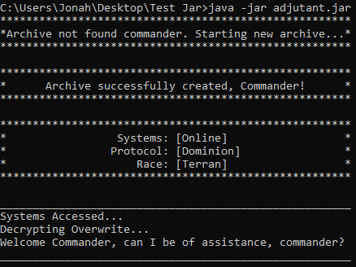
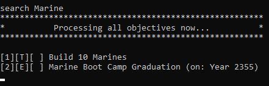

# [Adjutant] User Guide

Adjutant is your personal desktop assistant to help you manage your **_Tasks_**.
Adjutant is also optimized for use via the **Command Line Interface** (CLI). 

---

## Quick start
_Prerequisites: JDK 11, update IntelliJ to the most recent version._
1. Ensure that you have Java `11` or above installed in your computer.
2. Download the latest `adjutant.jar` from [here](https://github.com/jonahtwl/ip/releases/download/v0.1/adjutant.jar).
3. Copy the jar file into the folder where you want to use as the base folder for `Adjutant`
4. Run `cmd` and navigate to the base folder where you saved the `adjutant.jar`.
5. Run the command `java -jar adjutant.jar`. You should see something similar as follows:

6. Type the command in the command line and hit `Enter` to execute it. The list of
available commands can be seen [here](#features).

---

## Features 
Adjutant can recognise the following commands:
* [Add a task](#add-a-task-todo-deadline-event): `todo`, `deadline`, `event`
* [List all tasks](#list-tasks-list): `list`
* [Mark task as done](#mark-task-as-done-done): `done`
* [Delete a task](#delete-task-delete): `delete`
* [Search for a task](#search-task-by-a-keyword-search): `search`
* [Exits the program](#exit-adjutant-bye): `bye`

### Add a task: `todo`, `deadline`, `event`
_Adds a type of task to Adjutant's mainframe_

Format: `{todo/event/deadline} [description] /[timestamp header] [timestamp]`
> Sample _[todo]_ command: `todo Build 10 Marines`
>   Sample _[event]_ command: `event Boot Camp Graduation /on Year 2355`
>   Sample _[deadline]_ command: `deadline Submit Mission report /by Year 2455`

> 💡 **Tip:** The timestamp header following `/` can be 
any word, examples: `before`, `at`

### List tasks: `list`
_Lists all tasks in Adjutant's mainframe_

Format: `list`

### Mark task as done: `done`
_Marks the indexed task as done in Adjutant's mainframe_

Format: `done [index]`
> Sample command: `done 1`

### Delete task: `delete`
_Deletes the indexed task in Adjutant's mainframe_

Format: `delete [index]`
> Sample command: `delete 2`

### Search task by a keyword: `search`
_Searches for tasks that contains the keyword in Adjutant's mainframe_

Format: `search [keyword]`
> Sample command: `search Marine`

_Example:_
`search Marine` returns `marine` and `Marine`
> 💡 **Tip:** The searched keywords are not case-sensitive!

### Exit Adjutant: `bye`
_Ends the Adjutant program_

Format: `bye`

### Saving Adjutant's data
Adjutant's data are automatically saved in the hard disk after any command.

### Editing the Adjutant's saved file
Adjutant's data are saved as a `.TXT` file in `[base_folder]/Duke_Tasks.txt`.
Experienced users may opt to edit the data by updating the saved file directly.

---

## FAQ
**Question**: What if I do not have the save file in my directory?
 **Answer**: Adjutant will automatically create a save file upon executing the `jar`

**Question**: Can I load my friend's data into my Adjutant? 
 **Answer**: Yes, if the saved file is from another Adjutant program.
Or if the file is in a recognisable format by Adjutant.

---

## Command Summary

Command | Format | Example
--- | --- | ---
Add | `[taskType] [description] /[timestamp] [timestampheader]` | `event Coronation /on Year 2488`
List | `list` | `list`
Done | `done [index]` | `done 1`
Delete | `delete [index]` | `delete 2`
Search | `search [keyword]` | `search Marine`
Exit | `bye` | `bye`

---
_[Updated: 27th Feb 2021]_
