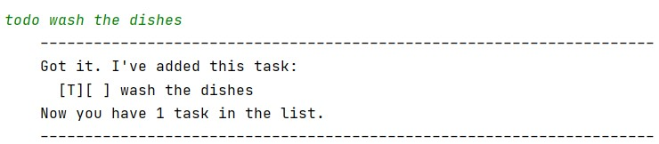
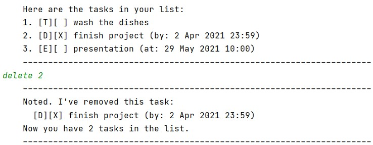

# Duke User Guide
____
Duke is a Personal Assistant Chatbot that helps you manage your various tasks. 

## Table of contents
____
* [Quick start](#quick-start)
* [Features](#features)
* [Usage](#usage)
    * [`todo` - Add a Todo](#todo---add-a-todo)
    * [`deadline` - Add a Deadline](#deadline---add-a-deadline)
    * [`event` - Add an Event](#event---add-an-event)
    * [`list` - Display all tasks](#list---display-all-tasks)
    * [`done` - Mark a task as done ✓](#done---mark-a-task-as-done-)
    * [`delete` - ~~Delete~~ a task](#delete---delete-a-task)
    * [`find` - Find tasks](#find---find-tasks)
    * [`bye` - Exit Duke](#bye---exit-duke)
* [Command summary](#command-summary)

## Quick start
____
1. Ensure you have Java `11` installed on your computer
1. Download the latest `v0.2.jar` from [here]()
1. Open a command window in the folder containing the `.jar` file
1. Run the command `java -jar {filename}.jar`   If you haven't changed the filename, run the command `java -jar v0.2.jar`

## Features
____

### Add tasks
Add tasks to keep track of.  
Duke has three subcategories of tasks you may add: 
* Todos
* Deadlines
* Events  

### Record Date & Time 
Date & time can be specified for deadline and event tasks. This allows you to have the information ready when needed. 

### List tasks
Display all your added tasks as a list.

### Mark task as done
Mark a task from your list of added tasks as done.

### Delete task
You may delete tasks that you no longer want to manage

### Find tasks
Find all tasks that contain the queried keyword and view them as a list. 

### Auto Save and Reload
All your tasks data is saved in the hard disk automatically, every time you make a change. Once you exit and reload the program, the saved data is loaded. This means you won't lose your data and you can pick up where you left off. 

## Usage
____
Words in `UPPER_CASE` are the parameters to be supplied by the user.
 e.g. in `todo TASK_DESCRIPTION`, `TASK_DESCRIPTION` is a parameter which can be used as `todo wash the dishes`

### `todo` - Add a Todo

Adds a Todo task to your task list 

Format: `todo TASK_DESCRIPTION`

Example of usage:
`todo wash the dishes`

Expected outcome:  

### `deadline` - Add a Deadline

Adds a Deadline task to your task list with a specified due date and time. Date and time must be in the given format. 

Format: `deadline TASK_DESCRIPTION /by DDMMYYYY HHMM`

Example of usage:
`deadline finish project /by 02/04/2021 2359`

Expected outcome:  

### `event` - Add an Event

Adds an Event task to your task list occuring at a specified date and time. Date and time must be in the given format.

Format: `event TASK_DESCRIPTION /at DDMMYYYY HHMM`

Example of usage:
`event presentation /at 29/05/2021 1000`

Expected outcome:  

### `list` - Display all tasks

Displays all your tasks with their type, completion status, and date & time (for deadlines and events). Tasks are shown as an ordered list.

Format: `list`

Expected outcome:  

### `done` - Mark a task as done ✓

Mark a task at a specified index, in your task list, as done

Format: `done INDEX`

Example of usage:
`done 2`

Expected outcome:  

### `delete` - ~~Delete~~ a task

Delete a task at a specified index, in your task list.

Format: `delete INDEX`

Example of usage:
`delete 2`

Expected outcome:  

### `find` - Find tasks

Finds all tasks that contain the specified keyword in their description. Displays these tasks as an ordered list.

Format: `find KEYWORD`

Example of usage:
`find presentation`

Expected outcome:  

### `bye` - Exit Duke

Exits the program with a goodbye message

Format: `bye`

Expected outcome:  

## Command summary
____

Action | Format, Examples
------ | ----------------
todo | `todo TASK_DESCRIPTION`   e.g. `todo wash the dishes`
deadline | `deadline TASK_DESCRIPTION /by DDMMYYYY HHMM`   e.g. `deadline finish project /by 02/04/2021 2359`
event | `event TASK_DESCRIPTION /at DDMMYYYY HHMM`   e.g. `event presentation /at 29/05/2021 1000`
list | `list`
done | `done INDEX`   e.g. `done 2`
delete | `delete INDEX`   e.g. `delete 2`
find | `find KEYWORD`   e.g. `find presentation`
bye | `bye`