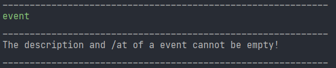

# User Guide
 Duke is a desktop app for keeping track of and managing your tasks,
it is intended for use via a Command Line Interface (CLI) and is optimized
for users who can type fast.
- [Quick start](#quick-start)
- [Commands](#commands)
- [Adding a todo: `todo`](#adding-a-todo-todo)
- [Adding an event: `event`](#adding-a-event-event)
- [Adding a deadline: `deadline`](#adding-a-deadline-deadline)
- [Listing tasks: `lisk`](#listing-tasks-list)
- [Finding tasks by name: `find`](#finding-tasks-by-name-find)
- [Deleting tasks: `delete`](#delete-a-task-delete)
- [Marking tasks as done: `done`](#marking-a-task-as-done-done)
- [Exiting the program: `bye`](#exiting-the-program-bye)
- [FAQ](#faq)
- [Command Summary](#command-summary)
- [Contributors](#contributors)
    
***
## Quick Start
1. Ensure that you have Java `11` JDK installed on your computer.
1. Download the latest `ip.jar` from [here](https://github.com/seangoats/ip/releases)!
1. Copy the file to a folder you want to use as home folder for Duke.
1. From a command line, run Duke by entering the following command:
```bash
java -jar ip.jar
```
***
## Commands

### Adding a Todo: `todo` 
Adds a Todo task to Duke.

Format: `todo DESCRIPTION`
- Adds a Todo with the specified description.
- Description of Todo must be given by user.


Examples: 
- `todo read book` adds a Todo with the description of read book

- `todo ` will cause Duke to produce an error message that the description cannot be empty


### Adding a Event: `event`
Adds a Todo task to Duke.

Format: `event DESCRIPTION /at TIME`
- Adds a Event with the specified description and time.
- Description and time of Event must be given by user.


Examples:
- `event meeting /at 2pm` adds a Event with the description of meeting and time of 2pm.
  
- `event ` will cause Duke to produce an error message that the description and /at cannot be empty
  
  -`event meeting` will cause Duke to produce an error message to give the correct form.
  

### Adding a Deadline: `deadline`
Adds a Todo task to Duke.

Format: `deadline DESCRIPTION /by TIME`
- Adds a Deadline with the specified description and time.
- Description and time of Deadline must be given by user.


Examples:
- `deadline report /by 4 March` adds a Deadline with the description of meeting and time of 4 March.
  
- `deadline` will cause Duke to produce an error message that the description and /by cannot be empty
  
  -`deadline report` will cause Duke to produce an error message to give the correct input format.
  

### Listing tasks: `list`
Lists all tasks tracked by Duke.

Format: `list`
- Lists all the tasks
- The command must be only `list`, any additional input will not be known

Examples:
- `list this` will not be recognized by Duke. 
  
- `list`
  
  
### Finding tasks by name: `find`
Finds and returns a list of tasks that match with a search term.

Format: `find SEARCH_TERM`
- Finds and lists all tasks that match with the search term.
- Search term must be provided, otherwise error message occurs.

#### Examples:
- `find book` returns all the tasks that match with "book".
   
- `find` returns an error message to say the search term canntot be empty.
  

### Delete a task: `delete`
Deletes a task based on the index provided.
Format: `delete INDEX`
- Deletes a task from the task list based on the index provided.
- Index provided is based on index in list from `list` command.
- Index must be provided.

#### Examples:

- `delete 2` will delete the task `[T][✘] this` from the task list.
  
- `delete` returns an invalid format error message as no index is provided.
  
- `delete 4` returns an error message to tell the user the index provided is out of bounds.
  

### Marking a task as done: `done`
Marks a task as done based on the index provided.

Format: `done INDEX`
- Marks a task as done from the task list based on the index provided.
- Index provided is based on index in list from `list` command.
- Index must be provided.

Examples:

- `done 2` will mark the task `[T][✘] this` as done from the task list.
  
- `done this` returns an invalid format error message as no index is provided.
  
- `done 4` returns an error message to tell the user the index provided is out of bounds.
  

### Exiting the program: `bye`
Exits the program

Format: `bye`
- Exits the program
- Data is saved to the storage text file before program terminates.

Examples:
- `bye` prints an exit message and exits the program.
  
  

## FAQ

**Q**: How to transfer my data to another computer?  
**A**: Place the storage text file in the same folder as `ip.jar` when running on another computer
  
## Command Summary:  
Command | Format, Examples
------------ | -------------
Add Todo |`todo DESCRIPTION` <br/>e.g. `todo read book`
Add Event | `event DESCRIPTION /at TIME` <br/>e.g. `event meeting /at 4pm`
Add Deadline | `deadline DESCRIPTION /by TIME` <br/> e.g. `return book /by Sunday`
List | `list`
Find | `find SEARCH_TERM` <br/> e.g `find book`
Delete | `delete INDEX` <br/> e.g. `delete 2`
Done | `done INDEX` <br/> e.g. `done 1`
Exit | `bye`

## Contributors:
Feel free to contact the developers if you want to contribute or if there are any issues or
bugs that you would like to report. Alternatively, you can use GitHub Issues for this as well!

Name | Role| Contact:
----| ---- | ----
Sean | Main Developer | [@seangoats](https://www.github.com/seangoats)

