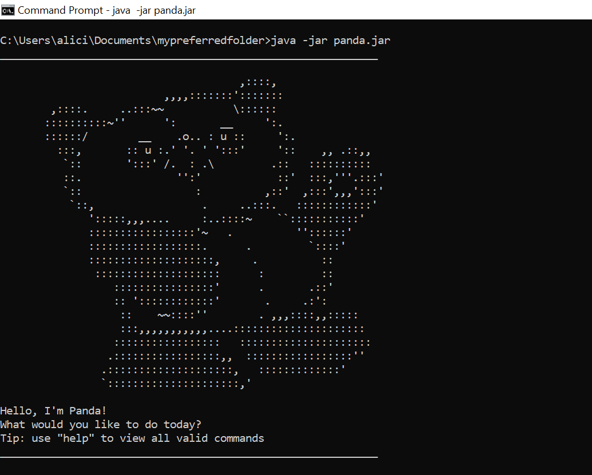

# User Guide

## Introduction
PANDA is a basic task manager that runs on a Command Line Interface (CLI).
With PANDA, you can add, view and find things you need to do as well as 
important deadlines and events. Finished a task? Great! Mark it as done. 
Task no longer relevant? Delete it from the list. PANDA gives you a simple way to
maintain a list of your everyday tasks.

## Table of Contents 
1. [Quick Start](#quick-start)
     - What you need
     - First run
2. [Features](#features)
     - [Showing the help page](#showing-the-help-page-help)
     - [Adding a to-do task](#adding-a-to-do-task-todo)
     - [Adding an event](#adding-an-event-event)
     - [Adding a deadline](#adding-a-deadline-deadline)
     - [Listing all tasks](#listing-all-tasks-list)
     - [Filtering deadlines by date](#filtering-deadlines-by-date-filter)
     - [Marking a task as done](#marking-a-task-as-done-done)
     - [Finding tasks by keyword](#finding-tasks-by-keyword-find)
     - [Deleting a task](#deleting-a-task-delete)
     - [Exiting the program](#exiting-the-program-bye)
3. [FAQ](#faq)
4. [Command Summary](#command-summary)
5. [Other Information](#other-information)

## Quick Start

### What you need
1. Ensure you have Java 11 or above installed. You can verify this with the 
   command `java --version` in the CLI.
2. Download the latest version of `panda.jar` from [here](https://github.com/aliciatay-zls/ip/releases) 
(under `Assets`). Move the file to your preferred folder. 
   
### First run
1. Open the CLI and navigate to the folder your `panda.jar` is located at.
2. Start the program with this command: `java -jar panda.jar`
3. A successful first run should show this welcome page:

## Features

>**Legend**
>
>Symbol/Letter | Task's | Meaning
>--------------|----------|--------
>[X] | status | is completed
>[ &nbsp;] | status | is not completed
>T | type | is a to-do
>E | type | is an event
>D | type | is a deadline
> 

 

### Showing the help page: `help`
Displays the list of command words, and their input formats.
  
**Format:**&nbsp;`help` 
  

### Adding a to-do task: `todo`
Adds the given task to the list.
  
**Format:**&nbsp;`todo <task description>`

**Example:** `todo buy bamboo`

**Expected outcome:**

    ______________________________________________________________________

    New task added:
        [T] [ ] buy bamboo
    ______________________________________________________________________

 

### Adding an event: `event`
Similar to adding a to-do task, this adds the given event to the list.
  
**Format:**&nbsp;`event <event description> /at <timing>`

**Example:** `event Panda Club Fundraising 2021 /at 6.00 pm`

**Expected outcome:**

    ______________________________________________________________________

    New task added:
        [E] [ ] Panda Club Fundraising 2021 (at: 6.00 pm)
    ______________________________________________________________________

**Notes:**
- `/at` must be part of the command
- `<timing>` (when the event is happening) is the suggested input 
  for this field, but you can enter any other type and number of details 
  of the event
  
  
### Adding a deadline: `deadline`
Adds the given deadline with its date and time to the list.
  
**Format:**&nbsp;`deadline <deadline description> /by <yyyy-mm-dd> <HH:mm>`

**Example:** `deadline sign up for Bamboo Eating Contest /by 2021-12-02 18:00`

**Expected outcome:**

    ______________________________________________________________________

    New task added:
        [D] [ ] sign up for Bamboo Eating Contest (by: Dec 02 2021, 6.00 pm)
    ______________________________________________________________________

**Notes:**
- `/by` must be part of the command
- date must be entered in full and dash-separated: `<yyyy-mm-dd>`
- time must be entered in 24-hour format and colon-separated: `<HH:mm>`
  

### Listing all tasks: `list`
Displays your tasks in a numbered list.
  
**Format:**&nbsp;`list`

**Example:** `list`

**Expected outcome:**

    ______________________________________________________________________

    Here are the tasks in your list:
    1. [T] [ ] buy bamboo
    2. [E] [ ] Panda Club Fundraising 2021 (at: 6.00 pm)
    3. [D] [ ] sign up for Bamboo Eating Contest (by: Dec 02 2021, 6.00 pm)
    ______________________________________________________________________

 

### Filtering deadlines by date: `filter`
Displays any deadlines in the list that fall on the given date, in their
_condensed form_.
  
**Format:**&nbsp;`filter <yyyy-mm-dd>`

**Example:** `filter 2021-12-02`

**Expected outcome:**

    ______________________________________________________________________

    Deadlines on this day:
        [ ] sign up for Bamboo Eating Contest (by: Dec 02 2021, 6.00 pm)
    ______________________________________________________________________

**Notes:**
- _condensed form_: only the status of the deadline, description and the
  time it is due will be displayed
  

### Marking a task as done: `done`
Marks the task that has the given index in the list with an 'X', to indicate
it is completed.
  
**Format:**&nbsp;`done <index>`

**Example:** `done 3`

**Expected outcome:**

    ______________________________________________________________________

    Yay! This task is now done:
        [D] [X] sign up for Bamboo Eating Contest (by: Dec 02 2021, 6.00 pm)
    There are 3 tasks in your list.
    ______________________________________________________________________

 

### Finding tasks by keyword: `find`
Displays _a new, numbered list_ of tasks from the main list that contain
the given keyword.
  
**Format:**&nbsp;`find <keyword>`

**Example:** `find bamboo`

**Expected outcome:**

    ______________________________________________________________________

    Tasks matching this keyword:
        1. [T] [ ] buy bamboo
        2. [D] [ ] sign up for Bamboo Eating Contest (by: Dec 02 2021, 6.00 pm)
    ______________________________________________________________________

**Notes:**
- `<keyword>` is case-insensitive
  

### Deleting a task: `delete`
Removes the task with the given index from the list.
  
**Format:**&nbsp;`delete <index>`

**Example:** `delete 1`

**Expected outcome:**

    ______________________________________________________________________

    This task has been removed:
        [T] [ ] buy bamboo
    There are 2 tasks in your list.
    ______________________________________________________________________

 

### Exiting the program: `bye`
Stops the PANDA application.
  
**Format:**&nbsp;`bye`
  

## FAQ
**Q: Does PANDA save the tasks I added after I stop the program?**
 
**A:** Yes! PANDA saves all changes made after each run and loads the previous 
task list before each run, in order to maintain your list of tasks. 
So if you don't see any messages about saving/loading, that's a good thing :D
  

**Q: Where can I view this list of tasks outside of PANDA??**
 
**A:** You can find it in the `data` folder that should be automatically created on the first run
(in the same folder `panda.jar` is located). The file name is `tasks.txt`. Do note however that PANDA
saves your tasks in a different format than is displayed when running the program.
For example, if you followed all the example commands on this user guide in the 
same order, opening `tasks.txt` shows something like this:

    E | 0 | Panda Club Fundraising 2021 | 6.00 pm
    D | 0 | sign up for Bamboo Eating Contest | 2021-12-02 | 18:00

 

## Command Summary
Command Word | Input Format
------------ | ------------
help | `help`
todo | `todo <task description>`
event | `event <event description> /at <timing>`
deadline | `deadline <deadline description> /by <yyyy-mm-dd> <HH:mm>`
list | `list`
filter | `filter yyyy-mm-dd`
done | `done <index>`
find | `find <keyword>`
delete | `delete <index>`
bye | `bye`

 

## Other Information
Done by: `Alicia Tay`

Originally: `Project Duke` from the module
[CS2113T (Year 2021 Sem 2)](https://nus-cs2113-ay2021s2.github.io/website/se-book-adapted/projectDuke/index.html)

  
