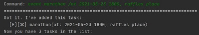
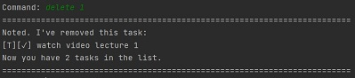
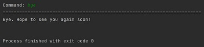

# Duke User Guide
Duke is an application that helps to keep track of the user's tasks. 
Particularly, **"Todo", "Deadlines" and "Events"**. This application 
focuses on using Command Line Interface(CLI). Users are able to add 
each task with a date and time to remind them of the deadlines and/or 
upcoming events. There are multiple functions such as **"list", "delete", 
"done","find"** to help user better manage their tasks. 

Whatever changes in the data will be automatically saved and updated into a text file. When the user reboots the application all 
their data will be retrieved from this text file and shown to the user upon request.

## Table of Contents
* [Quick start](#quick-start)
* [Features](#features)
    - [Add a todo task: `todo`](#add-a-todo-task-todo)
    - [Add a deadline task: `deadline`](#add-a-deadline-task-deadline)
    - [Add an event task: `event`](#add-an-event-task-event)
    - [List all tasks: `list`](#list-all-tasks-list)
    - [Mark a task as done: `done`](#mark-a-task-as-done-done)  
    - [Find tasks wth keyword: `find`](#find-tasks-with-keyword-find)
    - [Delete a task: `delete`](#delete-a-task-delete)
    - [Exit The Program: `bye`](#exit-the-program-exit)
* [Errors](#errors)    
    -[Command errors](#command-errors)
    -[Message errors](#file-errors)   
* [Command summary](#command-summary)
* [FAQ](#faq)
 
  
## Quick Start

1) Ensure that you have java version JDK 11 or later to sure proper function of the application.
   
2) Download the latest jar file from [here](https://github.com/JoviYeung92/ip/releases)
   
3) Save the file to your preferred folder.

4) Open your windows command prompt then type **java -jar c:`jarfilepath.jar`"** then following image will be shown.
   

5)  Begin using the application by typing the command in the command box and press Enter to execute it.
    e.g. typing `list` and pressing Enter, it will display all tasks stored in the data.
    Some example commands are given below:
    
    * `todo watch video lecture`
  
    * `deadline return book /by mon`
  
    * `event marathon /at 2021-05-13 6pm`
  
    * `list`
  
    * `find marathon`
  
    * `delete 3`
  
    * `done 2`

## Features 

### Add a todo task: `todo`
~This feature allows the user to add a 'todo' task.

Format: `todo DESCRIPTION`

Example: 
-`todo watch video lecture 1`
-`todo do tutorial 1`

   
  

### Add a deadline task: `deadline` 

~This feature allows the user to add a 'deadline' task.

Format: `deadline DESCRIPTION /by DATE and/or TIME`

Example: 
-`deadline return book /by mon 6pm`
-`deadline submit report /by 2021-02-21 1800`

   
  

### Add an event task: `event` 

~This feature allows the user to add a 'event' task.

Format: `event DESCRIPTION /at DATE/time and/or Location`

Example: 
-`event marathon /at 2021-05-23 1800, raffles place`
-`event meeting /at NUS`

   
  

### List all tasks: `list` 
~This feature will print all the task in the list.

Format: `list`

   
  

### Mark a task as done: `done`
This feature will set the status of a task to 'done'.

Format: `done INDEX`

Example: 
-`done 1`

   
  

### Find tasks with keyword: `find`
This feature will find and print all the task with the given input keyword.

Format: `find KEYWORD`

Example: 
-`find marathon` 

   
  

### Delete a task: `delete`
This feature will delete the given index task.

Format: `delete INDEX`

Example: 
-`delete 1`

   
  

### Exit the program: `exit`
Exits the program at any point of time. 

Format: `bye`

   
  

## Errors 
Almost all errors are captured by the systems and will be displayed to the user to correct them. Below are the all 
the known errors with their description.

### Command errors
| Message | Description |
|---------|-------------|
|`☹ OOPS!!! I'm sorry, but I don't know what that means :-(` | Input not recognized.|
|`☹ OOPS!!! The description of a todo cannot be empty.`| Todo task is empty, enter the description.|
|`☹ OOPS!!! The description of a deadline task cannot be empty.` | Deadline task is empty, enter the description.|
|`Please re-enter. Format of deadline task is wrong. E.g., deadline DESCRIPTION /by DATETIME"`| Format of deadline task is wrong.|
|`☹ OOPS!!! The description of a event task cannot be empty.`| Event task is empty, enter the description.|
|`Please re-enter. Format of event task is wrong. E.g., event DESCRIPTION /at DATE/TIME, LOCATION`| Format of event task is wrong.|
|`Index out of bound, please re-enter.`| When 'done' or 'delete' function is entered and the index to it is out of bound.|
|`No matching task found.`| when 'find' function is entered and no task related to the keyword is found. |

### File Errors
| Message | Description |
|---------|-------------|
|`No file exist, new file "tasklist.txt" created in home directory.`| When the app is used for the first time there is no existing data file. Hence, app will create a new file.|
|`File corrupted! Please delete "tasklist.txt" in the home directory and reboot the application. `| Data is corrupted due to undesired changes in the file.|
|`Error writing to file, please reboot.`| Unexpected error when writing to the file that rarely occurs.|

## Command summary

| Format  | Usage | Example |
| --------- | ------ | ------- |
| **Todo** | `todo DESCRIPTION` | `todo do tutorial 1` |
| **Deadline** | `deadline DESCRIPTION /by DATETIME` | `deadline submit report /by 2021-02-21 1800`|
| **Event** | `event DESCRIPTION /at DATETIME,LOCATION` or  `event DESCRIPTION /at LOCATION` | `event marathon /at 2021-05-23 1800, raffles place` or   `event meeting /at NUS` |
| **List** | `list` | `list` |
| **Delete** | `delete INDEX` | `delete 1` |
| **Done** | `done INDEX`| `done 1` |
| **Find** | `find KEYWORD` | `find marathon` |
| **Bye** | `bye` | `bye` |

## FAQ
Question 1 - Is the data transferable if i change computer?
 
Answer 1 - Yes, simply locate the `tasklist.txt` file in the home directory and copy that file to another computer.

Question 2 - If the system crashes mid-way will the new tasks that are added be lost?
Answer 2 - No, The list of tasks will auto-save upon every entry, even when the system crashes midway all data will be saved and retrieve again when the application reboots.
 

Question 3 - Can I add and edit from the text file directly?
 
Answer 3 - Yes, but this is not recommended because a single mistake will cause the file to be corrupted.

