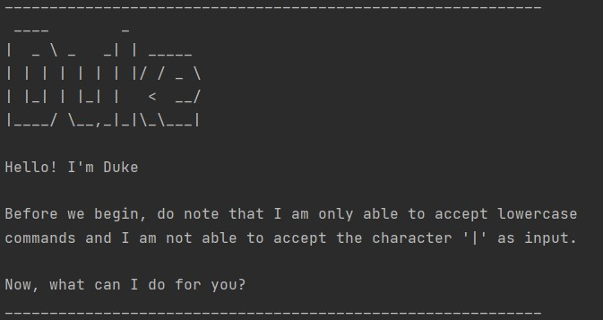

# Duke User Guide

By: `Gerard Tan Wei Kiat` Since: `March 2021`

- [Duke User Guide](#duke-user-guide)
    * [1. Introduction](#1-introduction)
    * [2. Quick Start](#2-quick-start)
    * [3. Features](#3-features)
        + [3.1 Adding a Todo task: `todo`](#31-adding-a-todo-task-todo)
        + [3.2 Adding a Deadline task: `deadline`](#32-adding-a-deadline-task-deadline)
        + [3.3 Adding an Event task: `event`](#33-adding-an-event-task-event)
        + [3.4 Listing all tasks: `list`](#34-listing-all-tasks-list)
        + [3.5 Completing a task: `done`](#35-completing-a-task-done)
        + [3.6 Deleting a task: `delete`](#36-deleting-a-task-delete)
        + [3.7 Searching tasks: `find`](#37-searching-tasks-find)
        + [3.8 Exiting Duke: `bye`](#38-exiting-duke-bye)
        + [3.9 Saving all tasks](#39-saving-all-tasks)
    * [4. Frequently Asked Questions (FAQ)](#4-frequently-asked-questions-faq)
    * [5. Command Summary](#5-command-summary)

## 1. Introduction

Duke is a command-line style personal assistant application that aims to help you in managing and tracking
your daily tasks.

## 2. Quick Start

Prerequisites: JDK 11

1. Ensure that you have `Java 11` installed on your computer.
2. Download the latest `ip.jar` from [here](https://github.com/gerardtwk/ip/releases/tag/A-Release).
3. Move `ip.jar` into a folder of your choice. This will be the **installation directory** of `ip.jar`.
4. Launch a `command prompt` and `cd` to the installation directory of `ip.jar`.
5. To run `Duke`, run the command `java -jar ip.jar` and Duke will greet you with the following welcome message:

## 3. Features
NOTE: The commands listed below must be entered as **lowercase** letters.

### 3.1 Adding a Todo task: `todo`

Adds a Todo task to the existing list of tasks maintained by Duke.

Format: `todo <task_description>`

Example: `todo clear the trash`

Expected Output:

### 3.2 Adding a Deadline task: `deadline`

Adds a Deadline task to the existing list of tasks maintained by Duke.

Format: `deadline <task_description> /by <due_date>`

Example: `deadline submit assignment /by 15th March 2021 4pm`

Expected Output:

### 3.3 Adding an Event task: `event`

Adds an Event task to the existing list of tasks maintained by Duke.

Format: `event <task_description> /at <timeframe>`

Example: `event birthday party /at 15th June 2021 2pm to 4pm`

Expected Output:

### 3.4 Listing all tasks: `list`

Displays a list of all tasks maintained by Duke.

Format: `list`

Expected Output:

### 3.5 Completing a task: `done`

Marks the specified task as completed.

Format: `done <task_number>`

Example: `done 1`

Expected Output:

### 3.6 Deleting a task: `delete`

Deletes the specified task from the list of tasks maintained by Duke.

Format: `delete <task_number>`

Example: `delete 1`

Expected Output:

### 3.7 Searching tasks: `find`

Search all tasks that contains the provided keyword.

Format: `find <keyword>`

Example: `find 4pm`

Expected Output:

### 3.8 Exiting Duke: `bye`

Exits the Duke program.

Format: `bye`

Expected Output:

### 3.9 Saving all tasks

The list of tasks maintained by Duke are automatically saved into `saveFile.txt` upon the successful execution of a 
`todo`, `deadline`, `event`, `done`, `delete` or `bye` command. 

Tasks saved in `saveFile.txt` are automatically loaded whenever Duke starts.

## 4. Frequently Asked Questions (FAQ)

**Q1**: Where is `saveFile.txt` located after I close the program?
> `saveFile.txt` is located in the installation directory of Duke. 
>  If it is not located there, Duke will automatically create it for you in the installation directory.

**Q2**: How can I transfer my saved tasks information to another computer?
> Run Duke on the other computer and overwrite the empty `saveFile.txt` created, with the `saveFile.txt` that
> contains the data of your previous Duke usage.

## 5. Command Summary

Command | Format | Example |
------- | ------- | ------- | 
todo | `todo <task_description>` | `todo clear the trash` |
deadline | `deadline <task_description> /by <due_date>` | `deadline submit assignment /by 15th March 2021 4pm` |
event | `event <task_description> /at <timeframe>` | `event birthday party /at 15th June 2021 2pm to 4pm` |
list | `list` | - |
done | `done <task_number>` | `done 1` |
delete | `delete <task_number>` | `delete 1` |
find | `find <keyword>` | `find 4pm` |
bye | `bye` | - |